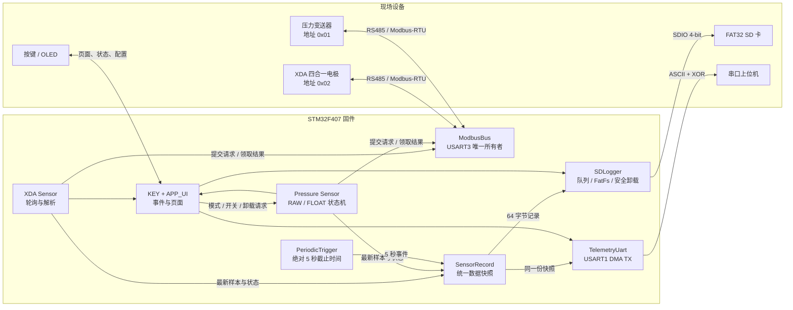
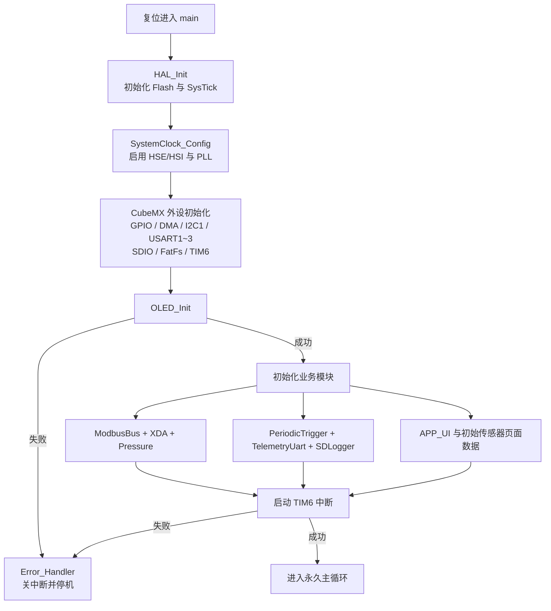
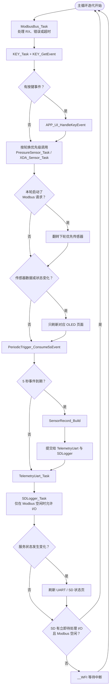
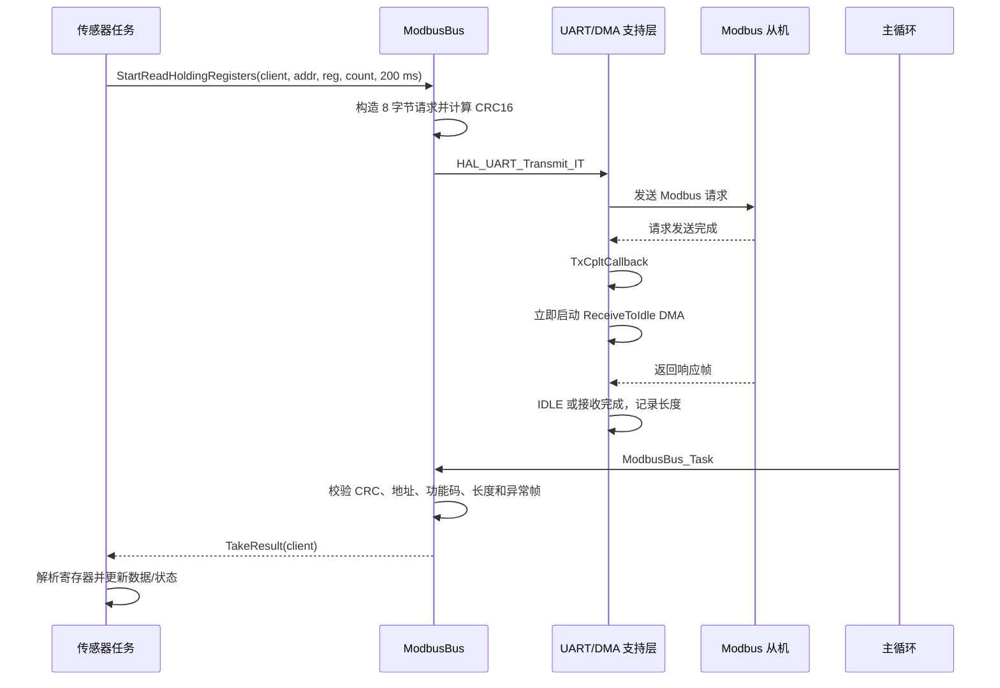
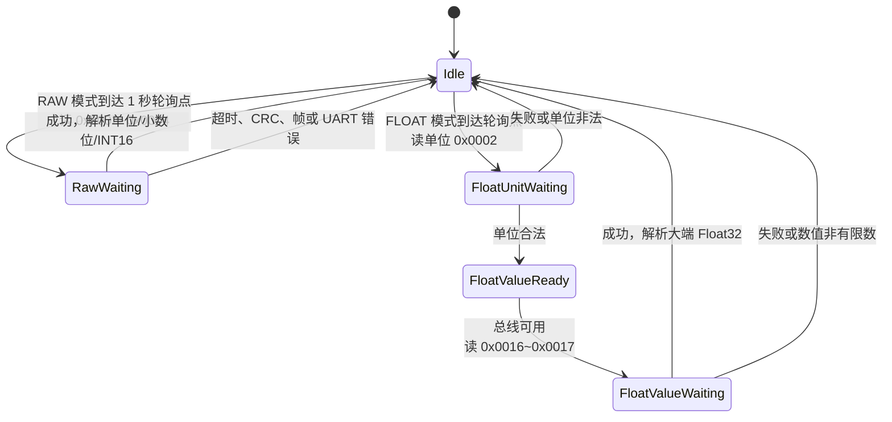
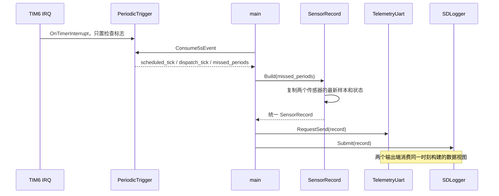
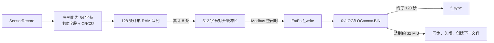
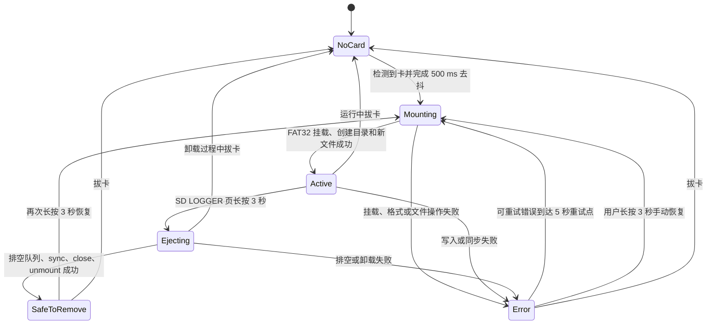
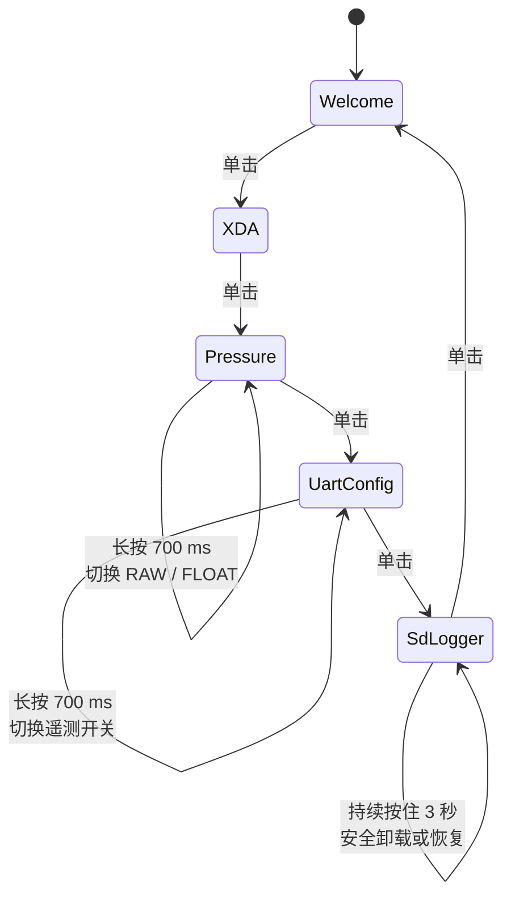
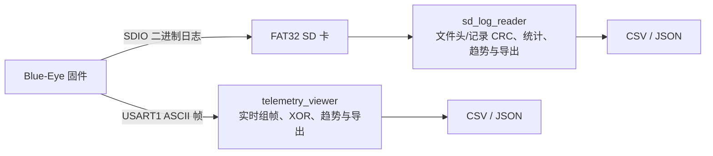

# Blue-Eye 工程工作流程与工作原理

本文面向固件维护、联调和二次开发人员，按当前源码说明 Blue-Eye 从上电初始化、双传感器轮询、周期快照生成，到 USART1 遥测、SD 卡记录和 OLED 交互的完整工作链路。

> 本文描述的是当前工程实现，而不是抽象设计稿。关键入口为 `Core/Src/main.c`，默认传感器地址、周期和队列大小均来自现有源码。

## 1. 系统目标与设计思路

Blue-Eye 需要同时处理三类节奏不同的工作：

1. 约每秒轮询两类 Modbus 传感器，及时处理串口收发和错误。
2. 每 5 秒构建一份统一数据快照，并同时用于串口遥测和 SD 日志。
3. 响应按键、刷新 OLED、处理 SD 卡插拔和安全卸载。

工程没有引入 RTOS，而是采用协作式主循环：中断负责记录“事件已经发生”，业务模块在主循环中以短步骤推进状态机。只有 FatFs 文件系统调用和 OLED I2C 刷新仍是同步操作，因此主循环会尽量把 SD I/O 安排在 Modbus 总线空闲时，并用绝对截止时间调度器处理偶发阻塞造成的周期跨越。

这种架构的核心原则是：

- 外设资源只有一个明确所有者。
- 中断回调不做协议解析和文件系统操作。
- 模块通过状态、事件位和只读数据快照协作。
- 周期数据只有一个构建入口，多个输出端共享同一份快照。
- 可恢复错误被状态机吸收，不让局部故障卡死整个主循环。

## 2. 总体架构



### 2.1 资源所有权

| 资源 | 唯一业务所有者 | 其它模块如何使用 |
| --- | --- | --- |
| `USART3` | `modbus_bus.c` | 传感器模块只提交请求、领取结果，不直接调用 HAL UART |
| `USART1 TX` | `telemetry_uart.c` | 周期模块只提交 `SensorRecord` |
| FatFs / 日志文件 | `sd_logger.c` | 主循环提交记录和卸载/恢复请求 |
| 传感器最新数据 | 各传感器模块 | UI 和 `sensor_record` 通过只读指针获取 |
| OLED | `app_ui.c` 通过 `oled.c` 使用 | 其它模块只暴露状态，不直接绘图 |
| 5 秒节拍 | `periodic_trigger.c` | TIM6 只通知，主循环消费事件 |

单一所有者设计减少了共享外设的隐式耦合。例如新增第三个 Modbus 从机时，只需要增加新的客户端适配层，并继续通过 `ModbusBus_StartReadHoldingRegisters()` 排队竞争总线，而不应在新模块中直接操作 `huart3`。

## 3. 上电初始化流程



初始化顺序具有依赖关系：

- OLED 驱动依赖 `I2C1` 已初始化。
- `ModbusBus_Init()` 必须早于两个传感器模块，以便传感器取得真实 USART3 波特率。
- `TelemetryUart_Init()` 依赖 `USART1` 及其 TX DMA 已配置。
- `SDLogger_Init()` 只读取卡检测状态，真正挂载会在主循环且总线允许 I/O 时发生。
- `PeriodicTrigger_Init()` 先建立首个 `now + 5000 ms` 截止点，再启动 TIM6。

## 4. 主循环工作流程

主循环每次迭代都只推进有限工作，不使用软件延时等待外设完成。



### 4.1 为什么先推进 ModbusBus

UART/DMA 中断只设置完成标志。主循环首先调用 `ModbusBus_Task()`，可尽快把刚完成的响应转换为总线结果；随后对应传感器任务在同一次迭代中领取结果、更新数据，并有机会在满足间隔后启动下一笔事务。

### 4.2 双传感器公平性

XDA 和压力传感器都约每 `1000 ms` 尝试轮询一次，但 `USART3` 同一时刻只能存在一笔事务。主循环保存一个优先标志：

- 一轮先调用 XDA，下一轮可能先调用压力。
- 只要任一传感器成功启动请求，就翻转下一次的优先顺序。
- 总线忙、结果尚未领取或 4 ms 帧间隔未结束时，新请求会被拒绝，传感器下轮再试。

这不是带队列的复杂调度器，而是适合两个周期相近客户端的轻量轮换仲裁。

### 4.3 何时进入低功耗等待

当本轮没有必须连续推进的 SD I/O 时，主循环执行 `__WFI()`。SysTick、TIM6、UART、DMA、SDIO 或按键 EXTI 中断都会唤醒 CPU。TIM6 每秒唤醒一次，也自然为两个约 1 秒轮询任务提供运行机会。

若 SD 已积累完整扇区、正在卸载或已到挂载时刻，主循环会在 Modbus 空闲时直接开始下一轮，而不是立即睡眠，从而尽快排空日志工作。

## 5. 中断与前台代码的边界

| 中断来源 | 中断中完成的工作 | 留给主循环的工作 |
| --- | --- | --- |
| `SysTick` | 增加 HAL 毫秒 Tick | 所有超时、轮询间隔和截止时间判断 |
| `TIM6` | 设置“需要检查截止时间”标志 | 判断是否真正到达 5 秒截止点并构建快照 |
| `EXTI0` | 读取按键边沿、去抖并记录事件 | 页面切换、模式切换、遥测开关、SD 卸载 |
| `USART3 / DMA1_Stream1` | HAL 推进发送/接收；回调记录完成、长度或错误 | Modbus CRC、地址、长度、异常和超时检查 |
| `USART1 / DMA2_Stream7` | HAL 完成 DMA；回调设置 `tx_done` | 统计成功/失败，发送下一份待发快照 |
| `SDIO / DMA2_Stream3/6` | HAL SD/DMA 完成及底层诊断状态 | FatFs 挂载、写入、同步、关闭和错误状态机 |

这种边界使协议解析、字符串格式化和文件系统调用都不占用高优先级中断上下文。

当前业务中断优先级从高到低大致为：USART3 与 RX DMA（2）、SDIO DMA（3）、SDIO（4）、USART1 与 TX DMA（6）、TIM6（8）、按键和调试串口（10）、SysTick（15）。优先级配置同时保存在源码和 `blue-eye.ioc` 中，CubeMX 再生成后应检查两者仍一致。

## 6. Modbus 总线工作原理

`modbus_bus.c` 是 USART3 的唯一所有者。当前支持功能码 `0x03`，一次最多读取 16 个保持寄存器（32 字节数据）。

### 6.1 一笔事务的时序



### 6.2 请求阶段

总线启动请求前会检查：

- UART 句柄有效。
- 客户端不是 `NONE`。
- 寄存器数量在 `1..16` 范围内。
- 超时非 0。
- 当前没有活动事务，也没有尚未被客户端领取的结果。
- 距离上一帧结束至少经过约 `4 ms` 帧间隔。

请求帧固定为 8 字节：从机地址、功能码 `0x03`、起始寄存器、寄存器数量和 Modbus CRC16。发送前会清 UART 错误标志和 DMA 上下文状态。

### 6.3 接收阶段

请求使用 UART 中断方式发送。发送完成回调不等待主循环，而是立即启动 `HAL_UARTEx_ReceiveToIdle_DMA()`，缩短收发切换间隙。DMA 半传输中断被关闭，只有接收完成、IDLE 或错误事件需要通知上层。

主循环中的 `ModbusBus_Task()` 按以下优先级处理：

1. UART/DMA 错误：中止收发，返回 `UART_ERROR`。
2. 已收到响应：解析实际长度。
3. 超过事务超时：中止收发，返回 `TIMEOUT`。

正常响应还必须依次通过：最小长度、CRC16、从机地址、异常响应识别、期望总长度、功能码和字节数检查。任何不一致都会转换为明确结果码，而不是把不完整数据交给传感器模块。

## 7. 传感器轮询与数据模型

两个传感器模块都维护：最新数值、在线标志、最近状态、最近成功时间、最近尝试时间、样本序号、成功/错误计数、连续失败次数和最近 Modbus 异常码。

连续失败达到 3 次后，已经上线过的传感器会被标记为离线；在首次成功之前发生任何失败，也保持离线。成功响应会清零连续失败计数并增加独立样本序号。

### 7.1 XDA 四合一电极

XDA 默认每秒读取一次：

| 项目 | 值 |
| --- | --- |
| 从机地址 | `0x02` |
| 功能码 | `0x03` |
| 起始寄存器 | `0x0000` |
| 寄存器数量 | `4` |
| 超时 | `200 ms` |

8 字节数据按大端寄存器顺序解析为：

- `EC × 100`
- `温度 × 10`，有符号 16 位
- `TDS ppm`
- `盐度 ppm`

### 7.2 压力传感器

压力传感器具有 RAW 和 FLOAT 两种模式。



RAW 模式一次读取 3 个寄存器：

- `0x0002`：单位代码，允许范围 `0..23`。
- `0x0003`：小数位数，允许范围 `0..4`。
- `0x0004`：有符号 16 位压力原始值。

实际工程值为 `pressure_raw / 10^decimal_point`，OLED 根据小数位格式化。

FLOAT 模式分两笔 Modbus 事务：先读取单位，再读取 `0x0016..0x0017` 的大端 Float32。只有数值是有限浮点数且模式仍为 FLOAT 时，`float_valid` 才会置位。

模式切换会把下次轮询时间复位，使新模式尽快生效；切回 RAW 时立即清除 `float_valid`，避免旧浮点值被误认为当前有效值。

## 8. 5 秒周期快照

### 8.1 为什么 TIM6 是 1 秒，而业务周期是 5 秒

TIM6 配置为约 1 秒中断，但它不直接累计 5 次后生成数据。中断只设置一个检查标志；`periodic_trigger.c` 使用 `HAL_GetTick()` 维护绝对截止时间：

```text
next_deadline = initial_tick + 5000
每次到期后：next_deadline += periods_due * 5000
```

这样不会因为每轮代码执行耗时而产生持续漂移。

### 8.2 阻塞恢复和跳号

如果某次 FatFs 或 OLED 同步操作跨过多个 5 秒截止点，恢复后调度器只派发最新到期点对应的一次事件，同时计算 `missed_periods`。`SensorRecord_Build()` 将序号增加 `missed_periods + 1`，因此日志和遥测能从序号跳变识别丢失的周期，而不会在恢复后快速生成多条使用同一批传感器数据的伪历史记录。

### 8.3 快照扇出



快照同时包含“快照构建时间”和“各传感器最近成功采样时间/序号”。因此上位机或离线解析器可以区分：

- 周期事件是否按时产生。
- 当前数据是否来自新的传感器样本。
- 某个传感器是否离线，但仍保留最后一次成功值。

## 9. USART1 遥测原理

遥测模块接收 `SensorRecord` 后，把数据格式化为 15 字段 ASCII payload：

```text
$BE,<tick>,<pressure...>,<xda...>*XX\r\n
```

其中 `XX` 是 `BE,...` payload 所有字节的 XOR。FLOAT 压力被放大 1000 转为整数；浮点值无效时发送 `INT32_MIN`，避免文本协议出现不稳定的 `nan` 表示。

发送流程：

1. 5 秒事件调用 `TelemetryUart_RequestSend()` 保存一份待发快照。
2. 空闲时由 `TelemetryUart_Task()` 构造字符串并调用 `HAL_UART_Transmit_DMA()`。
3. DMA 完成回调设置 `tx_done`，主循环增加成功计数。
4. 发送超过 `500 ms` 或出现 UART 错误时，中止发送并增加错误计数。

若发送忙时又收到新快照，模块不会建立无限队列，而是用最新快照覆盖旧待发快照，并增加 `coalesced_count`。这个策略优先保证“看到最新状态”，适合周期遥测；完整历史则由 SD 日志承担。

遥测可在 `UART CONFIG` 页面关闭。关闭时会中止当前发送并清除待发状态，但不会影响传感器采集和 SD 日志。

## 10. SD 日志工作原理

### 10.1 日志数据路径



每条记录在入队时立即序列化并计算 CRC32。队列容量为 128 条，按 5 秒周期可吸收约 10 分 40 秒的待写数据。队列满时会覆盖最旧的未写记录并累计 `dropped_record_count`，使系统继续运行而不是因存储阻塞而停机。

正常情况下累计 8 条记录后形成一个 512 字节写入，约 40 秒写一次。这样与 SD 卡扇区大小对齐，减少大量 64 字节小写操作。

### 10.2 文件组织

- 仅接受 FAT32；不会自动格式化。
- 日志目录固定为 `0:/LOG`。
- 文件名为 `LOG00000.BIN` 到 `LOG99999.BIN`，启动新会话时扫描已有文件并选择最大序号加一。
- 每个文件先写入并同步 512 字节文件头，再接受记录。
- 单文件超过约 `32 MiB` 前会先滚动到下一文件，不覆盖历史文件。
- 文件头和每条记录都包含独立 CRC32。

精确字段和偏移见 [SD 传感器日志格式](./sensor_log_format.md)。

### 10.3 SDLogger 状态机



状态含义：

| 状态 | 行为 |
| --- | --- |
| `NO_CARD` | 不访问文件系统；周期快照计入 skipped |
| `MOUNTING` | 等待卡稳定和 I/O 许可，挂载 FAT32 并创建新文件 |
| `ACTIVE` | 接收入队；完整扇区达到条件时写入；脏文件按周期同步 |
| `EJECTING` | 停止接收新记录，允许写出不足 8 条的尾批次 |
| `SAFE_TO_REMOVE` | 文件已关闭、文件系统已卸载，保持不自动重挂载 |
| `ERROR` | 释放文件系统资源；按错误类型自动或手动重试 |

### 10.4 插拔卡与安全卸载

卡检测使用原始状态和稳定状态两级处理，插拔变化需要保持 `500 ms` 才生效；插卡后还会再等待 `500 ms` 再尝试挂载。

安全卸载的顺序是：

1. `accepting_records = 0`，新周期记录计入 skipped。
2. 写出全部队列，包括不足 8 条的最后一批。
3. `f_sync()`。
4. `f_close()`。
5. `f_mount(NULL, ...)` 卸载。
6. 使底层 SD 初始化缓存失效。
7. 进入 `SAFE_TO_REMOVE`。

运行中直接拔卡会停止后续文件系统访问、清空队列，并把未写记录计入丢弃数量。安全卸载可以降低数据损坏概率，但仍不能替代稳定供电和适当的掉电保护设计。

## 11. OLED 与按键交互

按键接在 `PA0`，按下为高电平，使用双边沿 EXTI：

- 去抖：`30 ms`
- 普通长按：`700 ms`
- SD 安全卸载长按：`3000 ms`



UI 不按固定帧率刷新，而是事件驱动：

- 传感器数据或状态变化时，只刷新当前对应传感器页。
- 遥测、周期或 SD 状态变化时，只在 `UART CONFIG` 或 `SD LOGGER` 页刷新。
- 切页和配置操作会立即重绘当前页面。

OLED 使用同步 I2C 发送，但由于只在内容变化时刷新，避免了在主循环中持续全屏刷新的开销。

## 12. 数据一致性与故障隔离

### 12.1 一致性边界

系统的“一致”是指同一个 5 秒事件内：遥测和 SD 日志来自同一个 `SensorRecord`。它不意味着两个传感器在完全同一毫秒采样。记录中的 `pressure_sample_tick`、`xda_sample_tick` 和独立样本序号用于表达这种时间差。

### 12.2 状态与最后有效值

通信失败会更新状态、错误计数和在线标志，但不会主动清空最后一次成功数值。消费者必须同时查看：

- `online`
- `status`
- `last_update_tick`
- `sample_sequence`

这种设计便于 UI 保留最后读数，也允许日志解析器计算样本年龄；但分析数据时不能只看数值而忽略状态。

### 12.3 各输出端的拥塞策略

| 输出端 | 拥塞策略 | 设计取向 |
| --- | --- | --- |
| USART1 遥测 | 只保留最新待发快照，旧待发快照被合并 | 实时性优先 |
| SD 日志 | 128 条 FIFO；满时覆盖最旧记录 | 历史完整性优先，同时避免系统停机 |
| OLED | 只在状态变化或当前页需要时刷新 | 降低同步 I2C 开销 |

### 12.4 时间回绕

工程大量时间判断使用无符号减法或带符号差值比较，能正确处理 `HAL_GetTick()` 的 32 位自然回绕。日志中的 Tick 仍是 32 位值；跨越约 49.7 天回绕点进行离线分析时，解析端需要按模 `2^32` 理解时间差。

## 13. PC 端闭环

仓库提供两个本地 Web 工具，使固件输出能够直接进入验证和分析流程。



- [遥测数据接口查看器](../tools/telemetry_viewer/README.md) 面向联机调试，能识别串口分块、帧外噪声和 XOR 错误。
- [SD 日志解析器](../tools/sd_log_reader/README.md) 面向离线数据，校验文件头与逐记录 CRC，统计跳号、截断和传感器趋势。

二者分别对应“最新状态”和“长期历史”，也能交叉验证同一时间附近的传感器值和状态。

## 14. 关键参数汇总

| 参数 | 当前值 | 源码位置 |
| --- | ---: | --- |
| XDA 轮询间隔 | `1000 ms` | `Core/Src/xda_sensor.c` |
| 压力轮询间隔 | `1000 ms` | `Core/Src/pressure_sensor.c` |
| Modbus 单事务超时 | `200 ms` | 两个传感器模块 |
| Modbus 帧间隔 | `4 ms` | `Core/Src/modbus_bus.c` |
| 周期快照 | `5000 ms` | `Core/Inc/periodic_trigger.h` |
| 遥测发送超时 | `500 ms` | `Core/Src/telemetry_uart.c` |
| SD 卡去抖 / 稳定等待 | `500 / 500 ms` | `Core/Src/sd_logger.c` |
| SD 自动重试间隔 | `5000 ms` | `Core/Src/sd_logger.c` |
| SD RAM 队列 | `128` 条 | `Core/Src/sd_logger.c` |
| SD 批量写入 | `8 × 64 = 512` 字节 | `Core/Src/sd_logger.c` |
| SD 同步间隔 | 最长约 `120 s` | `Core/Src/sd_logger.c` |
| 单日志文件上限 | 约 `32 MiB` | `Core/Src/sd_logger.c` |
| 按键去抖 / 长按 / 卸载长按 | `30 / 700 / 3000 ms` | `Core/Src/key.c` |

## 15. 源码导航

| 文件 | 职责 |
| --- | --- |
| `Core/Src/main.c` | 初始化顺序、主循环调度和低功耗等待 |
| `Core/Src/modbus_bus.c` | Modbus 请求、CRC16、事务状态和结果分发 |
| `Core/Src/uart_dma_support.c` | UART IT/DMA 状态桥接和 HAL 回调 |
| `Core/Src/xda_sensor.c` | XDA 轮询、寄存器解析和状态维护 |
| `Core/Src/pressure_sensor.c` | 压力 RAW/FLOAT 多阶段状态机 |
| `Core/Src/periodic_trigger.c` | 绝对截止时间、迟到和错过周期统计 |
| `Core/Src/sensor_record.c` | 周期快照及 64 字节记录序列化 |
| `Core/Src/telemetry_uart.c` | ASCII 遥测协议、XOR 和 DMA 发送 |
| `Core/Src/sd_logger.c` | 卡检测、FatFs 会话、队列、滚动和卸载 |
| `Core/Src/key.c` | EXTI 去抖与按键事件识别 |
| `Core/Src/app_ui.c` | 页面状态、操作响应和 OLED 渲染 |
| `Core/Src/stm32f4xx_it.c` | 中断入口及 TIM6 周期通知 |
| `Core/Src/dma.c` / `usart.c` / `sdio.c` / `tim.c` | CubeMX 外设与 NVIC 配置 |

## 16. 扩展工程时的约束

### 新增 Modbus 传感器

1. 为客户端增加独立枚举值和数据模型。
2. 通过 `ModbusBus` 提交事务，不直接操作 USART3。
3. 让任务函数保持非阻塞，只返回事件位。
4. 在主循环中加入明确的公平调度规则。
5. 如需进入统一输出，在 `SensorRecord` 中增加版本化字段，并同步更新日志格式和 PC 解析器。

### 修改快照周期

修改 `PERIODIC_TRIGGER_PERIOD_MS` 后，还需要确认：

- SD 队列覆盖时间和写入频率是否合适。
- 遥测带宽是否足够。
- 文件头中的 `sample_period_ms` 会自动随宏更新。
- PC 工具中是否存在对 5 秒间隔的展示假设。

### 修改日志记录格式

记录是固件与离线工具之间的二进制 ABI。应同时：

1. 增加 `SENSOR_RECORD_FORMAT_VERSION`。
2. 明确新字段偏移、端序和 CRC 覆盖范围。
3. 更新 `sensor_record.c`。
4. 更新 `docs/sensor_log_format.md`。
5. 更新 `tools/sd_log_reader` 及测试样本。
6. 保持旧版本解析策略明确，避免静默误读。

### 引入手动 DE/RE 控制

当前默认 RS485 模块自动收发。如果换成需要方向控制的收发器，DE/RE 切换必须纳入 UART 事务状态：发送前置发送态、真正的 UART TC 后切回接收态，再启动 Receive-to-IDLE DMA。不要只依据 DMA 完成判断物理总线已经发送结束。

## 17. 已知边界

- 当前没有有效 RTC，所有时间都是启动后的毫秒 Tick。
- FatFs 和 OLED 刷新仍可能同步占用主循环；绝对时间调度只能正确记录错过周期，不能恢复当时未采集的真实数据。
- ModbusBus 当前只支持读取保持寄存器功能码 `0x03`，没有通用写寄存器接口。
- 双传感器仲裁是轻量轮换，不是通用多客户端优先级队列。
- 日志安全卸载降低但不能完全消除意外断电造成的文件系统风险。
- SD 文件号达到 `99999` 后会拒绝继续创建文件，需要离线归档或调整命名策略。

理解这些边界后，Blue-Eye 的维护重点可以概括为：保持外设单一所有权、保持状态机非阻塞、保持统一快照的版本一致性，并让任何新增输出端都明确自己的拥塞和错误恢复策略。
